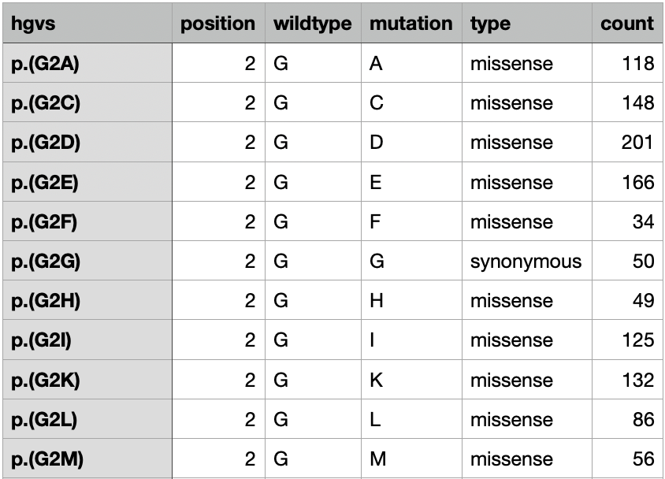

```{r, echo=FALSE, message=FALSE, warning=FALSE}
library(dplyr)
library(ggplot2)
library(readr)
library(stringr)
library(colorspace)
library(cowplot)
library(ggpubr)
library(lilace)
```

## Overview

Lilace is a tool for scoring FACS-based DMS experiments with uncertainty quantification. It takes in a negative control group (usually synonymous variants) and scores each variant relative to the negative control group.

The standard workflow is:

1. Import data into Lilace format
2. Normalize to cell sorting percentages (if available)
3. Run Lilace. On a full length protein, Lilace usually takes a few hours to run (see paper supplement for more details)
4. Analyze Lilace output

This notebook shows an example run of Lilace from installation to analysis on a toy dataset. We provide functions to load counts into Lilace's input format (step 1), normalize counts to cell sorting proportions (step 2), run Lilace (step 3), and plot the results (step 4). By default, Lilace incorporates variance in the negative control scores into effect size uncertainty (standard errors) and makes use of similar effects at a position to improve estimation. Both of these behaviors can optionally be turned off when running Lilace. 

## Installation
Lilace is built using `stan` and interacts with `CmdStan` using the package `cmdstanr`. This requires C++ compilation. The compiler requirements can be seen at [stan-dev](https://github.com/stan-dev/stan/wiki/Coding-Style-and-Idioms#supported-cpp-versions-and-compilers).
If you run into issues with installation, please ensure your gcc version is > 5.

First, we install `cmdstanr`. We recommend running this in a fresh R session or restarting your current session.
```{r, eval = FALSE}
install.packages("cmdstanr", repos = c('https://stan-dev.r-universe.dev', getOption("repos")))
```
Then, we use `cmdstanr` to install `CmdStan`. This requires a working C++ toolchain and compiler.
```{r, eval = FALSE}
library(cmdstanr)
install_cmdstan(cores = 2) # number of cores to use for installation
```
We can check the `CmdStan` version to verify correct installation.
```{r, eval = FALSE}
cmdstan_version()
```
Now, we can install Lilace from github.
```{r, eval = FALSE}
if (!requireNamespace("devtools", quietly = TRUE)) {
  install.packages("devtools")
}
devtools::install_github("pimentellab/lilace")
library(lilace)
```

## Load input data
Next, we load in the toy dataset, which includes the first 20 positions of a GPR68 screen from (https://www.cell.com/cell/fulltext/S0092-8674(24)01373-4). This data is provided with a standard installation of Lilace.
```{r}
load(system.file("extdata", "gpr68_ph55_20pos.RData", package="lilace"))
head(dataset)
```
We then put the data into a Lilace object using the `lilace_from_counts()` function, which requires:

1. variant identifier (e.g. hgvs), ensure this is unique for each variant
2. mutation type (e.g. synonymous, missense)--this will be used to identify the negative controls
3. residue position
4. replicate information
5. the FACS bin counts
6. any metadata you wish to carry over into the final output.
```{r}
# load from components
lilace_obj <- lilace_from_counts(variant_id=dataset$hgvs, mutation_type=dataset$type, 
                      position=dataset$position, replicate=dataset$rep, 
                      counts=dataset %>% select(starts_with("c_")), 
                      metadata=dataset %>% select(wildtype, mutation, exp))
head(lilace_obj$data)
```
We also provide the functions `lilace_from_enrich()`, which can load counts from enrich2's output format, and `lilace_from_files()`, which can load counts from separate bin and replicate count files, but they may not generalize to all dataset formats. See the end of this vignette for an example call of each.

## Normalize to cell sorting proportions
FACS gating is often set to contain equal proportions of the overall cell fluorescence distribution, but differences in bin PCR amplification can lead to the over and under representation of certain bins in the read counts. If this is the case, the data can be normalized to the sorting proportions using the `lilace_sorting_normalize()` function, which takes in a Lilace object and the proportions to normalize to.

{width=60%}

In this case the sort proportions don't add up to 1, but that's okay, they are scaled to add up to 1 internally.
```{r}
# normalize to sorting proportions
GPR_FACS_trace_percent_55 <- c(0.2184, 0.1972, 0.1869, 0.1236)

lilace_obj <- lilace_sorting_normalize(lilace_obj, GPR_FACS_trace_percent_55, rep_specific=F)
head(lilace_obj$normalized_data)
```
If we wish to normalize to replicate-specific sorting proportions, we can format it like the following. The replicate labels in the list (R1, R2, R3) should correspond to the labels used in the Lilace input. 
```{r}
# normalize to sorting proportions
GPR_FACS_trace_percent_55 <- list(R1=c(0.2184, 0.1972, 0.1869, 0.1236),
                                  R2=c(0.2184, 0.1972, 0.1869, 0.1236),
                                  R3=c(0.2184, 0.1972, 0.1869, 0.1236))

lilace_obj <- lilace_sorting_normalize(lilace_obj, GPR_FACS_trace_percent_55, rep_specific=T)
head(lilace_obj$normalized_data)
```

## Run Lilace
Once, we are ready to run Lilace, we first specify an output directory where the output and model fitting logs will be saved.
```{r}
output_dir <- "output"
```
Then, we use the function `lilace_fit_model()` to run the main Lilace algorithm. This should only take a few minutes on this truncated dataset, but usually takes a few hours on a full length protein.

By default, the negative controls will be identified by variants labeled as `synonymous` in the `lilace$data$type` column. This can be changed by setting the `control_label` argument to a different value in the column. To disable the negative control-based bias correction, set `control_correction` to `FALSE`. To disable position-level grouping, set `use_positions` to `FALSE`. We provide example outputs for both of these options towards the end of the vignette.
```{r, warning=FALSE, message=FALSE}
lilace_obj <- lilace_fit_model(lilace_obj, output_dir, control_label="synonymous", 
                               control_correction=T, use_positions=T, pseudocount=T,
                               n_parallel_chains=4)
```
Once it's done running, Lilace saves the scores for each variant to `output/lilace_output/variant_scores.tsv`. The scores dataframe is also saved in `lilace_obj$scores`. The scores are also combined with the input dataframe at `lilace_obj$fitted_data`.
```{r}
scores <- read_tsv("output/lilace_output/variant_scores.tsv", show_col_types = FALSE)
head(scores)
```
The `effect` column represents the estimated effect size / score for a variant, while `effect_se` gives the standard error. `lfsr` is the local false sign rate, which is a Bayesian measure of significance analogous to a p-value. For example, a default way to call discoveries would be to set a threshold of `lfsr < 0.05`. We encode this in the `discovery05` column where a `-1` indicates a significant leftward shift in fluorescence, `+1` a significant rightward shift, and `0` is not significant. `pos_mean` and `pos_sd` are the estimated position-level mean and variance parameters--these parameters are only included in the final score table if Lilace was run with `use_positions=T`.

## Plot results
To analyze the output of the model, we can first plot the score distributions of the different mutation types using `lilace_score_density()` and ensure they align with expectations.
```{r, warning=FALSE}
lilace_score_density(scores, output_dir, score.col="effect", 
                     name="score_histogram", hist=T, scale.free=T)
```

We observe a substantial LOF mode for indels, a smaller one for missense mutations, and a distribution around zero for synonymous mutations.

Next, we plot the estimated scores on a heatmap.
```{r, warning=FALSE}
lilace_score_heatmap(scores, output_dir, score.col="effect", name="score_heatmap", 
                     x.text=4, seq.text=1.5, y.text=3)
```

As well as the discoveries, at a threshold of `lfsr < 0.05`. Again, -1 indicates a significant leftward shift in fluorescence, +1 a rightward shift, and 0 is not significant.
```{r, warning=FALSE}
lilace_score_heatmap(scores, output_dir, score.col="discovery05", name="discovery05_heatmap", 
                     x.text=4, seq.text=1.5, y.text=3)
```

From here on, further analysis can be done, such as mapping to protein structure and qualitatively analyzing the results.

## Example runs without negative control correction or position hierarchy

#### Without the negative control-based bias correction
Without the negative control-based bias correction, the effect size standard errors are smaller and more effects are called significant (at the cost of more false positives). You may want to run this in cases where variance in negative controls do not provide a good estimate of experimental uncertainty (e.g. only a single WT variant), but you still want Lilace scores for each variant. In this case, Lilace uncertainty estimates (effect standard errors) do not incorporate any notion of negative control variance, which may result in more false positives. (note: a control label column is still required as a reference set to score against)

```{r, message=FALSE}
# specify outpur dir
output_dir <- "output_no_nc_correction"
# run the model on data
fitted_data <- lilace_fit_model(lilace_obj, output_dir, control_label="synonymous", 
                                control_correction=F)
# read scores file
scores <- read_tsv("output_no_nc_correction/lilace_output/variant_scores.tsv", show_col_types = FALSE)
print(head(scores))
lilace_score_heatmap(scores, output_dir, score.col="effect", name="score_heatmap", 
                     x.text=4, seq.text=1.5, y.text=3)
lilace_score_heatmap(scores, output_dir, score.col="discovery05", name="discovery05_heatmap", 
                     x.text=4, seq.text=1.5, y.text=3)
```

#### Without the position hierarchy
Without using position effects to inform variant effect estimates, each effect size will be completely independent of the others at its position. You may want to run this if the data has more than a single residue mutation at a time or complete position independence is desired for downstream analysis (e.g. clinical classification that uses multiple effects at a position as a line of evidence). 
```{r, message=FALSE}
# specify outpur dir
output_dir <- "output_nopos"
# run the model on data
fitted_data <- lilace_fit_model(lilace_obj, output_dir, control_label="synonymous", 
                                use_positions=F)
# read scores file
scores <- read_tsv("output_nopos/lilace_output/variant_scores.tsv", show_col_types = FALSE)
print(head(scores))
lilace_score_heatmap(scores, output_dir, score.col="effect", name="score_heatmap", 
                     x.text=4, seq.text=1.5, y.text=3)
lilace_score_heatmap(scores, output_dir, score.col="discovery05", name="discovery05_heatmap", 
                     x.text=4, seq.text=1.5, y.text=3)
```

## View posterior samples
For convenience and advanced analysis, the posterior samples are saved in `lilace_output/posterior_samples.RData`. They can be analyzed further with the `posterior` package. Here is an example of how to access them:
```{r, warning=FALSE, message=FALSE}
library(posterior)
draws <- readRDS("output/lilace_output/posterior_samples.RData")
posterior_samples <- posterior::as_draws_rvars(draws)
head(posterior::draws_of(posterior_samples$a))
```

## Format input data from Enrich2 output format

This function expects data in the following format created through processing counts with Enrich2.
{width=60%}

```{r, warning=FALSE}
enrich_file <- system.file("extdata", "kir21_enrich_format.tsv", package="lilace")
lilace_obj_from_enrich <- lilace_from_enrich(enrich_file, pheno="abundance") # filtering to just the abundance phenotype
head(lilace_obj_from_enrich$data)
```

## Format input from separate gating files
Here, we provide an example of formatting from multiple input files where the counts for each bin and replicate are in different files (such as from the Dumpling processing pipeline). The counts will be joined by shared column names, so each file must have at least a variant id column, a position column, and a mutation type column. For example the counts from bin 1 in replicate 1 could look like:
{width=60%}

```{r, message=FALSE}
# input files in list format 
# (can add more replicates or bins--make sure they are in order from left to right)
file_list <- list(R1=list(
  system.file("extdata", "multi_input/R1_A.tsv", package="lilace"), # rep 1 bin 1
  system.file("extdata", "multi_input/R1_B.tsv", package="lilace"), # rep 1 bin 2
  system.file("extdata", "multi_input/R1_C.tsv", package="lilace"), # rep 1 bin 3
  system.file("extdata", "multi_input/R1_D.tsv", package="lilace")  # rep 1 bin 4 
  ),
                  R2=list(
  system.file("extdata", "multi_input/R2_A.tsv", package="lilace"), # rep 2 bin 1 
  system.file("extdata", "multi_input/R2_B.tsv", package="lilace"), # rep 2 bin 2
  system.file("extdata", "multi_input/R2_C.tsv", package="lilace"), # rep 2 bin 3
  system.file("extdata", "multi_input/R2_D.tsv", package="lilace")) # rep 2 bin 4
  ) 
lilace_obj_from_multi_file <- lilace_from_files(file_list, 
                                                variant_id_col="hgvs",
                                                position_col="position",
                                                mutation_type_col="type",
                                                count_col="count", # column containing count is called count
                                                delim="\t") 

head(lilace_obj_from_multi_file$data)
```


